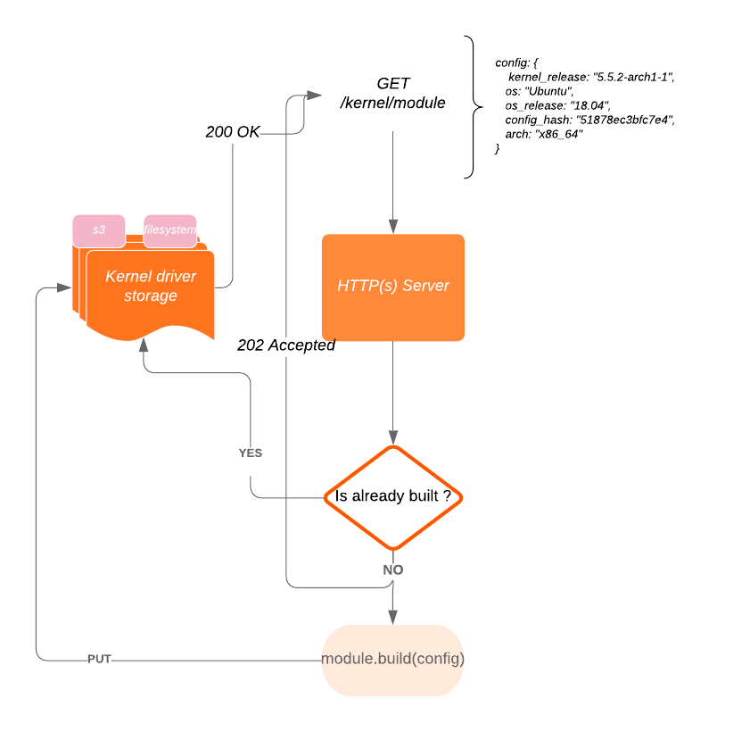

# Falco Build Service

Status: Under development

## Client usage

### Request a  build

```bash
echo '{"buildType": "vanilla", "architecture": "x86_64", "kernelversion": "5.5.2", "kernelConfigData": "'"$(zcat /proc/config.gz|base64)"'"}' | 
    curl  --header "Content-Type: application/json"   -d @-  -v http://127.0.0.1:8093/v1/module
```

### Retrieve a built module

## Goals
- [x] Have a package that can build the kernel module in k8s - **DONE** (look at [/pkg/modulebuilder](/pkg/modulebuilder))
- [x] Have a package that can verify the kernel module - **DONE** (look at [/pkg/modinfo](/pkg/modinfo))
- [x] To have a mechanism that can fetch the kernel sources for a given distribution (or alternatively, a vanilla kernel) and setup a module build environment for it for any given kernel version. - DONE for vanilla kernel
- [x] To store artifacts (modules and packages) on a remote storage like s3 (low priority) as well as the local filesystem (high priority) - DONE for local filesystem
- [ ] Expose an endpoint to grab built Kernel modules that builds them on demand when are not found in the storage
- [ ] Find a way to allow rebuilds when a module is corrupted or needs to be refreshed (like for branch names used as moduleversion)

## Todo after the MVP

- [ ] Kernel module build endpoint rate limiting and DDoS prevention
- [ ] Expose a DEB repository for Falco Ubuntu/Debian packages
- [ ] Expose an RPM repository for Falco CentOS/RHEL/Fedora packages

## Interactions Diagram


